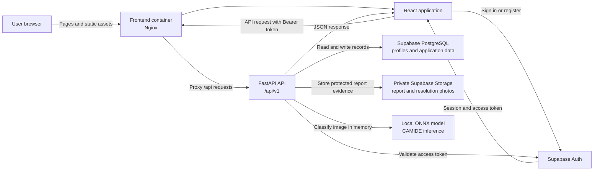
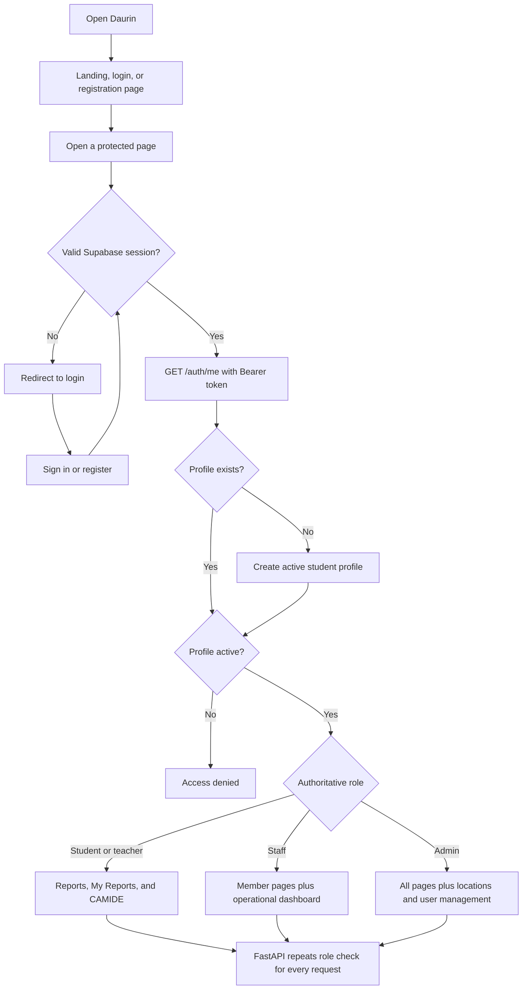
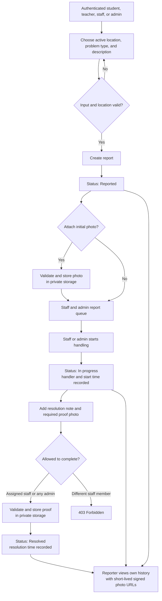
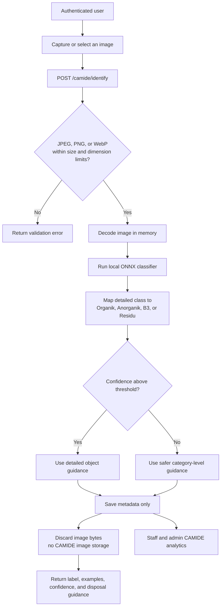
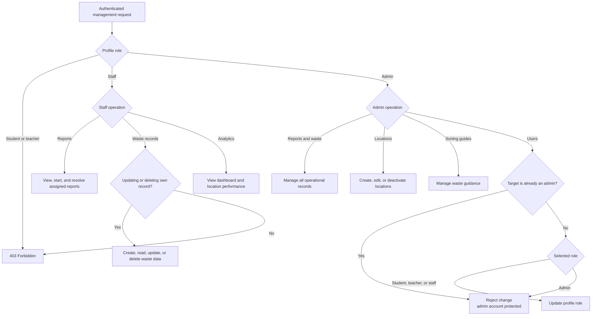
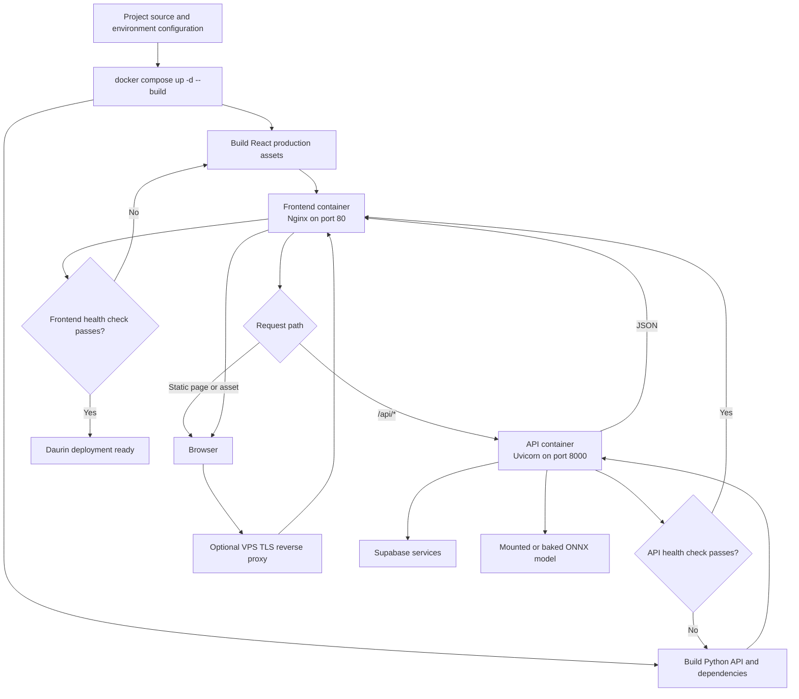

# Daurin Application Flowcharts

These diagrams describe how users, containers, backend services, Supabase, and
the CAMIDE model interact. They reflect the current application behavior and
role restrictions.

## 1. System architecture and communication

The React application uses Supabase directly only for authentication. All
application records are accessed through FastAPI, which loads the authoritative
role from `public.profiles` on protected requests.

## 2. Authentication and role-based routing

Frontend route guards improve navigation, but FastAPI remains the security
boundary. A hidden or manually called route is still rejected when the profile
role is not permitted.

## 3. Cleanliness report lifecycle

The valid status sequence is strictly `reported -> in_progress -> resolved`.
Report and completion photos are stored privately; the UI receives temporary
signed URLs instead of public storage paths.

## 4. CAMIDE waste identification

Stored metadata includes the user, category, detailed object label, confidence,
model version, and timestamp. The captured CAMIDE image is never written to
Supabase Storage.

## 5. Staff and administrator operations

Location deletion is implemented as deactivation so historical reports remain
intact. A staff member may create waste records but may only modify or delete
records they own; an administrator may manage all operational records.

## 6. Docker deployment and request flow

In the provided Compose setup, the frontend is available on host port `5173`
and the API on host port `8000`. Inside the Docker network, Nginx proxies
`/api/*` to the `api:8000` service. A production VPS should terminate HTTPS at
a trusted reverse proxy before forwarding requests to the frontend container.

## Role summary

| Flow | Student | Teacher | Staff | Admin |
| --- | :---: | :---: | :---: | :---: |
| Create and track reports | Yes | Yes | Yes | Yes |
| Use CAMIDE | Yes | Yes | Yes | Yes |
| Process reports | No | No | Yes | Yes |
| Manage waste records | No | No | Own records | All records |
| View operational dashboards | No | No | Yes | Yes |
| Manage locations and guides | No | No | No | Yes |
| Change non-admin user roles | No | No | No | Yes |

